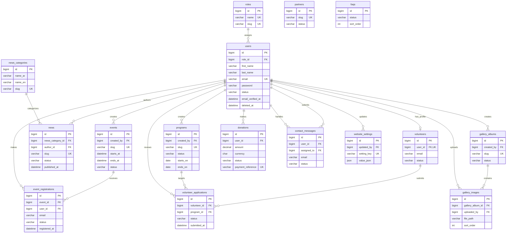

# Majaddidun Association Management System
## MySQL Database Architecture and ERD

**Status:** Design only  
**Scope:** Database architecture, ERD, keys, constraints, and relationships  
**Out of scope for this phase:** Laravel migrations, Eloquent models, API endpoints, authentication implementation, seeders, and frontend integration

This document is the database source of truth for the future Laravel backend. It is
designed for MySQL 8.0+ with Laravel conventions and an `utf8mb4` character set.

The platform is bilingual. User-facing content uses explicit Arabic and English
columns (`*_ar` and `*_en`) so both translations can be queried, indexed, and
validated independently. Website settings use JSON because settings may have
different shapes and may contain localized values.

---

## 1. Design principles

### Naming and types

- Tables use Laravel plural `snake_case` names.
- Primary keys use `BIGINT UNSIGNED AUTO_INCREMENT`, exposed through Laravel's
  `$table->id()` convention.
- Foreign keys use `BIGINT UNSIGNED` and the related table's singular name with
  an `_id` suffix.
- Text uses `VARCHAR` for bounded values and `TEXT`/`LONGTEXT` for content.
- Dates and times use `DATETIME`/`DATE`; all stored timestamps are UTC.
- Monetary values use `DECIMAL(12, 2)`, never floating-point types.
- ISO currency codes use `CHAR(3)`.
- Booleans use `TINYINT(1)`.
- Statuses are stored as bounded `VARCHAR` values with database `CHECK`
  constraints. Laravel enums/constants should mirror these values in application
  code without making schema changes necessary for every new status.

### Foreign-key deletion policy

- User references in historical/content records generally use `SET NULL`, so
  deleting a user does not erase published content, donations, or messages.
- Ownership children such as gallery images use `CASCADE` on a hard delete.
- Soft-deleted parents are not physically deleted during normal application
  operation. Services must soft-delete or restore dependent records explicitly
  when that behavior is required.
- Role assignment rows cascade when their user or role is hard-deleted.

### Soft deletes

The following business tables have `deleted_at DATETIME NULL`:

`users`, `news_categories`, `news`, `events`, `programs`, `gallery_albums`,
`gallery_images`, `volunteers`, `volunteer_applications`, `donations`,
`contact_messages`, `partners`, and `faqs`.

Framework support tables, pivots, password-reset records, personal access tokens,
sessions, and website settings do not use soft deletes. Their lifecycle is
explicit and operational rather than content-oriented.

---

## 2. Entity relationship diagram

The diagram shows the logical relationships. Each user belongs to one primary
role through `users.role_id`. `personal_access_tokens` is polymorphic, so its
tokenable relationship is represented separately from normal foreign keys.

---

## 3. Authentication and authorization tables

### 3.1 `users`

Stores authentication credentials and the canonical user profile. Each user has
one primary role through `users.role_id`; volunteer participation is modeled by
the separate `volunteers` profile and application tables.

| Column | Type | Null | Default | Key / constraints |
|---|---|---:|---|---|
| `id` | `BIGINT UNSIGNED` | No | auto increment | Primary key |
| `role_id` | `BIGINT UNSIGNED` | No | — | FK to `roles.id`, `RESTRICT` |
| `first_name` | `VARCHAR(100)` | No | — | Required |
| `last_name` | `VARCHAR(100)` | No | — | Required |
| `email` | `VARCHAR(255)` | No | — | Unique; normalize to lowercase in application code |
| `phone` | `VARCHAR(30)` | Yes | `NULL` | Index; store normalized international value |
| `password` | `VARCHAR(255)` | No | — | Hashed password only |
| `avatar_path` | `VARCHAR(500)` | Yes | `NULL` | Relative object/storage path |
| `bio` | `TEXT` | Yes | `NULL` | Profile biography |
| `locale` | `VARCHAR(5)` | No | `'ar'` | Check: `ar` or `en` |
| `status` | `VARCHAR(20)` | No | `'active'` | Check: `pending`, `active`, `suspended`, `deactivated` |
| `email_verified_at` | `DATETIME` | Yes | `NULL` | — |
| `phone_verified_at` | `DATETIME` | Yes | `NULL` | — |
| `last_login_at` | `DATETIME` | Yes | `NULL` | — |
| `remember_token` | `VARCHAR(100)` | Yes | `NULL` | Laravel session authentication |
| `created_at` | `DATETIME` | No | — | Laravel timestamp |
| `updated_at` | `DATETIME` | No | — | Laravel timestamp |
| `deleted_at` | `DATETIME` | Yes | `NULL` | Soft delete |

**Additional constraints and indexes**

- Unique index on `email`.
- Index on `status`.
- Index on `phone` where phone-based lookup is required.
- Check `locale IN ('ar', 'en')`.
- Check `status IN ('pending', 'active', 'suspended', 'deactivated')`.

**Relationships**

- Belongs to one `roles` record.
- Has zero or one `volunteers` profile.
- Has many authored `news`, created `events`, created `programs`,
  `gallery_albums`, and uploaded `gallery_images`.
- Has many `event_registrations` and `donations`.
- May submit `contact_messages` and may be assigned contact messages.
- May update `website_settings`.

### 3.2 `roles`

Defines authorization roles. The initial required records are `Admin`,
`Moderator`, `Volunteer`, and `User`. Role names are display labels; `slug` is
the stable authorization identifier.

| Column | Type | Null | Default | Key / constraints |
|---|---|---:|---|---|
| `id` | `BIGINT UNSIGNED` | No | auto increment | Primary key |
| `name` | `VARCHAR(50)` | No | — | Unique display name |
| `slug` | `VARCHAR(50)` | No | — | Unique; expected values `admin`, `moderator`, `volunteer`, `user` |
| `description` | `VARCHAR(255)` | Yes | `NULL` | — |
| `created_at` | `DATETIME` | No | — | Laravel timestamp |
| `updated_at` | `DATETIME` | No | — | Laravel timestamp |

### 3.3 `password_reset_tokens`

Laravel password-reset infrastructure table. It follows the framework's
standard schema and is not soft-deleted because tokens expire and are replaced.

| Column | Type | Null | Default | Key / constraints |
|---|---|---:|---|---|
| `email` | `VARCHAR(255)` | No | — | Primary key; matches `users.email` |
| `token` | `VARCHAR(255)` | No | — | Store only a hashed reset token |
| `created_at` | `DATETIME` | Yes | `NULL` | — |

**Relationships**

- Logical relationship to `users.email`; no foreign key is recommended because
  Laravel's standard table uses email as its primary key and user email changes
  must not be blocked by expired reset records.

### 3.4 `personal_access_tokens`

Laravel Sanctum token table for API authentication.

| Column | Type | Null | Default | Key / constraints |
|---|---|---:|---|---|
| `id` | `BIGINT UNSIGNED` | No | auto increment | Primary key |
| `tokenable_type` | `VARCHAR(255)` | No | — | Polymorphic model class/type |
| `tokenable_id` | `BIGINT UNSIGNED` | No | — | Polymorphic user ID |
| `name` | `VARCHAR(255)` | No | — | Device/application label |
| `token` | `CHAR(64)` | No | — | Unique hash; never store plaintext |
| `abilities` | `TEXT` | Yes | `NULL` | JSON-encoded abilities |
| `last_used_at` | `DATETIME` | Yes | `NULL` | — |
| `expires_at` | `DATETIME` | Yes | `NULL` | — |
| `created_at` | `DATETIME` | Yes | `NULL` | Laravel timestamp |
| `updated_at` | `DATETIME` | Yes | `NULL` | Laravel timestamp |

**Constraints and indexes**

- Unique index on `token`.
- Composite index on (`tokenable_type`, `tokenable_id`).
- No conventional FK because `tokenable_id` is polymorphic.

**Relationships**

- Belongs polymorphically to the authenticatable user model.

### 3.5 `sessions` (optional database-backed session storage)

This table is only required if Laravel sessions are moved from the current
file-backed driver to the database driver.

| Column | Type | Null | Default | Key / constraints |
|---|---|---:|---|---|
| `id` | `VARCHAR(255)` | No | — | Primary key |
| `user_id` | `BIGINT UNSIGNED` | Yes | `NULL` | Index; FK to `users.id`, `SET NULL` |
| `ip_address` | `VARCHAR(45)` | Yes | `NULL` | IPv4/IPv6 |
| `user_agent` | `TEXT` | Yes | `NULL` | — |
| `payload` | `LONGTEXT` | No | — | Serialized session payload |
| `last_activity` | `INT UNSIGNED` | No | — | Index; Unix timestamp |

**Relationships**

- An optional session belongs to one user.

---

## 4. News

### 4.1 `news_categories`

Provides a single category for each news article in the initial design.

| Column | Type | Null | Default | Key / constraints |
|---|---|---:|---|---|
| `id` | `BIGINT UNSIGNED` | No | auto increment | Primary key |
| `name_ar` | `VARCHAR(150)` | No | — | Required |
| `name_en` | `VARCHAR(150)` | No | — | Required |
| `slug` | `VARCHAR(180)` | No | — | Unique |
| `description_ar` | `TEXT` | Yes | `NULL` | — |
| `description_en` | `TEXT` | Yes | `NULL` | — |
| `sort_order` | `INT UNSIGNED` | No | `0` | — |
| `is_active` | `TINYINT(1)` | No | `1` | Check 0 or 1 |
| `created_at` | `DATETIME` | No | — | Laravel timestamp |
| `updated_at` | `DATETIME` | No | — | Laravel timestamp |
| `deleted_at` | `DATETIME` | Yes | `NULL` | Soft delete |

**Relationships**

- Has many `news`.

### 4.2 `news`

Stores bilingual published and draft articles.

| Column | Type | Null | Default | Key / constraints |
|---|---|---:|---|---|
| `id` | `BIGINT UNSIGNED` | No | auto increment | Primary key |
| `news_category_id` | `BIGINT UNSIGNED` | Yes | `NULL` | FK to `news_categories.id`, `SET NULL` |
| `author_id` | `BIGINT UNSIGNED` | Yes | `NULL` | FK to `users.id`, `SET NULL` |
| `title_ar` | `VARCHAR(255)` | No | — | Required |
| `title_en` | `VARCHAR(255)` | No | — | Required |
| `slug` | `VARCHAR(255)` | No | — | Unique |
| `excerpt_ar` | `TEXT` | Yes | `NULL` | — |
| `excerpt_en` | `TEXT` | Yes | `NULL` | — |
| `content_ar` | `LONGTEXT` | No | — | Required |
| `content_en` | `LONGTEXT` | No | — | Required |
| `cover_image_path` | `VARCHAR(500)` | Yes | `NULL` | Storage/object path |
| `status` | `VARCHAR(20)` | No | `'draft'` | Check: `draft`, `published`, `archived` |
| `is_featured` | `TINYINT(1)` | No | `0` | Check 0 or 1 |
| `published_at` | `DATETIME` | Yes | `NULL` | Required when published |
| `views_count` | `INT UNSIGNED` | No | `0` | Check >= 0 |
| `created_at` | `DATETIME` | No | — | Laravel timestamp |
| `updated_at` | `DATETIME` | No | — | Laravel timestamp |
| `deleted_at` | `DATETIME` | Yes | `NULL` | Soft delete |

**Constraints and indexes**

- Index (`status`, `published_at`) for public listing.
- Index (`news_category_id`, `status`).
- Check `status = 'published'` implies `published_at IS NOT NULL`.

**Relationships**

- Belongs to an optional `news_categories` record.
- Belongs to an optional author in `users`.

---

## 5. Events and registrations

### 5.1 `events`

Stores public and internal association events.

| Column | Type | Null | Default | Key / constraints |
|---|---|---:|---|---|
| `id` | `BIGINT UNSIGNED` | No | auto increment | Primary key |
| `created_by` | `BIGINT UNSIGNED` | Yes | `NULL` | FK to `users.id`, `SET NULL` |
| `title_ar` | `VARCHAR(255)` | No | — | Required |
| `title_en` | `VARCHAR(255)` | No | — | Required |
| `slug` | `VARCHAR(255)` | No | — | Unique |
| `description_ar` | `LONGTEXT` | Yes | `NULL` | — |
| `description_en` | `LONGTEXT` | Yes | `NULL` | — |
| `location_ar` | `VARCHAR(255)` | Yes | `NULL` | — |
| `location_en` | `VARCHAR(255)` | Yes | `NULL` | — |
| `starts_at` | `DATETIME` | No | — | Required |
| `ends_at` | `DATETIME` | No | — | Check after `starts_at` |
| `registration_required` | `TINYINT(1)` | No | `0` | Check 0 or 1 |
| `capacity` | `INT UNSIGNED` | Yes | `NULL` | Check > 0 when set |
| `status` | `VARCHAR(20)` | No | `'draft'` | Check: `draft`, `published`, `cancelled`, `completed` |
| `cover_image_path` | `VARCHAR(500)` | Yes | `NULL` | Storage/object path |
| `is_featured` | `TINYINT(1)` | No | `0` | Check 0 or 1 |
| `created_at` | `DATETIME` | No | — | Laravel timestamp |
| `updated_at` | `DATETIME` | No | — | Laravel timestamp |
| `deleted_at` | `DATETIME` | Yes | `NULL` | Soft delete |

**Constraints and indexes**

- Index (`status`, `starts_at`) for upcoming events.
- Check `ends_at > starts_at`.
- Check `capacity IS NULL OR capacity > 0`.
- Check `status = 'published'` implies `deleted_at IS NULL`.

**Relationships**

- Belongs to an optional creator in `users`.
- Has many `event_registrations`.

### 5.2 `event_registrations`

Supports both authenticated users and guests. The snapshot fields remain
available if a user later changes their profile.

| Column | Type | Null | Default | Key / constraints |
|---|---|---:|---|---|
| `id` | `BIGINT UNSIGNED` | No | auto increment | Primary key |
| `event_id` | `BIGINT UNSIGNED` | No | — | FK to `events.id`, `CASCADE` |
| `user_id` | `BIGINT UNSIGNED` | Yes | `NULL` | FK to `users.id`, `SET NULL` |
| `registration_reference` | `CHAR(36)` | No | generated UUID | Unique public reference |
| `full_name` | `VARCHAR(200)` | No | — | Registrant snapshot |
| `email` | `VARCHAR(255)` | No | — | Registrant snapshot |
| `phone` | `VARCHAR(30)` | Yes | `NULL` | International format |
| `status` | `VARCHAR(20)` | No | `'registered'` | Check: `registered`, `confirmed`, `waitlisted`, `attended`, `cancelled` |
| `registered_at` | `DATETIME` | No | current UTC time | — |
| `cancelled_at` | `DATETIME` | Yes | `NULL` | — |
| `notes` | `TEXT` | Yes | `NULL` | Internal notes |
| `created_at` | `DATETIME` | No | — | Laravel timestamp |
| `updated_at` | `DATETIME` | No | — | Laravel timestamp |

**Constraints and indexes**

- Unique (`event_id`, `email`) to prevent duplicate active registrations for
  one email. If re-registration after cancellation is required, enforce this
  rule in a service instead and use a non-unique index.
- Unique `registration_reference`.
- Index (`event_id`, `status`).
- Index `email`.
- `registration_reference` should be `CHAR(36)` containing a UUID.

**Relationships**

- Belongs to one event.
- Optionally belongs to one authenticated user.

---

## 6. Programs

### 6.1 `programs`

Stores the association's ongoing and time-bound programs.

| Column | Type | Null | Default | Key / constraints |
|---|---|---:|---|---|
| `id` | `BIGINT UNSIGNED` | No | auto increment | Primary key |
| `created_by` | `BIGINT UNSIGNED` | Yes | `NULL` | FK to `users.id`, `SET NULL` |
| `title_ar` | `VARCHAR(255)` | No | — | Required |
| `title_en` | `VARCHAR(255)` | No | — | Required |
| `slug` | `VARCHAR(255)` | No | — | Unique |
| `summary_ar` | `TEXT` | Yes | `NULL` | — |
| `summary_en` | `TEXT` | Yes | `NULL` | — |
| `description_ar` | `LONGTEXT` | No | — | Required |
| `description_en` | `LONGTEXT` | No | — | Required |
| `cover_image_path` | `VARCHAR(500)` | Yes | `NULL` | Storage/object path |
| `status` | `VARCHAR(20)` | No | `'draft'` | Check: `draft`, `active`, `completed`, `archived` |
| `starts_on` | `DATE` | Yes | `NULL` | — |
| `ends_on` | `DATE` | Yes | `NULL` | Check after `starts_on` |
| `is_featured` | `TINYINT(1)` | No | `0` | Check 0 or 1 |
| `created_at` | `DATETIME` | No | — | Laravel timestamp |
| `updated_at` | `DATETIME` | No | — | Laravel timestamp |
| `deleted_at` | `DATETIME` | Yes | `NULL` | Soft delete |

**Constraints and indexes**

- Unique index on `slug`.
- Index (`status`, `starts_on`).
- Check `ends_on IS NULL OR starts_on IS NULL OR ends_on >= starts_on`.

**Relationships**

- Belongs to an optional creator in `users`.
- Has many `volunteer_applications`.

---

## 7. Gallery

### 7.1 `gallery_albums`

Groups related gallery images and provides the public album record.

| Column | Type | Null | Default | Key / constraints |
|---|---|---:|---|---|
| `id` | `BIGINT UNSIGNED` | No | auto increment | Primary key |
| `created_by` | `BIGINT UNSIGNED` | Yes | `NULL` | FK to `users.id`, `SET NULL` |
| `title_ar` | `VARCHAR(255)` | No | — | Required |
| `title_en` | `VARCHAR(255)` | No | — | Required |
| `slug` | `VARCHAR(255)` | No | — | Unique |
| `description_ar` | `TEXT` | Yes | `NULL` | — |
| `description_en` | `TEXT` | Yes | `NULL` | — |
| `cover_image_path` | `VARCHAR(500)` | Yes | `NULL` | Optional selected cover |
| `status` | `VARCHAR(20)` | No | `'draft'` | Check: `draft`, `published`, `archived` |
| `published_at` | `DATETIME` | Yes | `NULL` | Required when published |
| `sort_order` | `INT UNSIGNED` | No | `0` | — |
| `created_at` | `DATETIME` | No | — | Laravel timestamp |
| `updated_at` | `DATETIME` | No | — | Laravel timestamp |
| `deleted_at` | `DATETIME` | Yes | `NULL` | Soft delete |

**Relationships**

- Belongs to an optional creator in `users`.
- Has many `gallery_images`.

### 7.2 `gallery_images`

Stores image metadata and storage paths; binary files remain in object storage or
the configured Laravel filesystem rather than in MySQL.

| Column | Type | Null | Default | Key / constraints |
|---|---|---:|---|---|
| `id` | `BIGINT UNSIGNED` | No | auto increment | Primary key |
| `gallery_album_id` | `BIGINT UNSIGNED` | No | — | FK to `gallery_albums.id`, `CASCADE` on hard delete |
| `uploaded_by` | `BIGINT UNSIGNED` | Yes | `NULL` | FK to `users.id`, `SET NULL` |
| `file_path` | `VARCHAR(500)` | No | — | Required storage/object path |
| `file_name` | `VARCHAR(255)` | Yes | `NULL` | Original/display filename |
| `mime_type` | `VARCHAR(100)` | Yes | `NULL` | Validated image MIME type |
| `file_size` | `BIGINT UNSIGNED` | Yes | `NULL` | Bytes |
| `width` | `INT UNSIGNED` | Yes | `NULL` | Pixels |
| `height` | `INT UNSIGNED` | Yes | `NULL` | Pixels |
| `title_ar` | `VARCHAR(255)` | Yes | `NULL` | — |
| `title_en` | `VARCHAR(255)` | Yes | `NULL` | — |
| `alt_text_ar` | `VARCHAR(255)` | Yes | `NULL` | Accessibility text |
| `alt_text_en` | `VARCHAR(255)` | Yes | `NULL` | Accessibility text |
| `sort_order` | `INT UNSIGNED` | No | `0` | Album ordering |
| `is_featured` | `TINYINT(1)` | No | `0` | Check 0 or 1 |
| `created_at` | `DATETIME` | No | — | Laravel timestamp |
| `updated_at` | `DATETIME` | No | — | Laravel timestamp |
| `deleted_at` | `DATETIME` | Yes | `NULL` | Soft delete |

**Constraints and indexes**

- Index (`gallery_album_id`, `sort_order`).
- Check `file_size IS NULL OR file_size > 0`.
- Check `width IS NULL OR width > 0`.
- Check `height IS NULL OR height > 0`.

**Relationships**

- Belongs to one `gallery_albums` record.
- Belongs to an optional uploader in `users`.

---

## 8. Volunteers and applications

### 8.1 `volunteers`

Represents a volunteer profile. `user_id` is nullable so a visitor can apply
before creating an account; it becomes populated when the profile is linked to a
user.

| Column | Type | Null | Default | Key / constraints |
|---|---|---:|---|---|
| `id` | `BIGINT UNSIGNED` | No | auto increment | Primary key |
| `user_id` | `BIGINT UNSIGNED` | Yes | `NULL` | Unique FK to `users.id`, `SET NULL` |
| `first_name` | `VARCHAR(100)` | No | — | Applicant snapshot |
| `last_name` | `VARCHAR(100)` | No | — | Applicant snapshot |
| `email` | `VARCHAR(255)` | No | — | Index |
| `phone` | `VARCHAR(30)` | No | — | International format |
| `date_of_birth` | `DATE` | Yes | `NULL` | — |
| `address` | `VARCHAR(500)` | Yes | `NULL` | — |
| `city` | `VARCHAR(100)` | Yes | `NULL` | — |
| `country_code` | `CHAR(2)` | Yes | `NULL` | ISO 3166-1 alpha-2 |
| `skills` | `TEXT` | Yes | `NULL` | Free-text or normalized JSON in future |
| `availability` | `TEXT` | Yes | `NULL` | Availability description |
| `emergency_contact_name` | `VARCHAR(200)` | Yes | `NULL` | — |
| `emergency_contact_phone` | `VARCHAR(30)` | Yes | `NULL` | International format |
| `status` | `VARCHAR(20)` | No | `'pending'` | Check: `pending`, `active`, `inactive`, `rejected` |
| `notes` | `TEXT` | Yes | `NULL` | Internal staff notes |
| `created_at` | `DATETIME` | No | — | Laravel timestamp |
| `updated_at` | `DATETIME` | No | — | Laravel timestamp |
| `deleted_at` | `DATETIME` | Yes | `NULL` | Soft delete |

**Constraints and indexes**

- Unique index on nullable `user_id`; MySQL permits multiple `NULL` values.
- Index (`email`, `status`).
- Check `country_code IS NULL OR CHAR_LENGTH(country_code) = 2`.

**Relationships**

- Optionally belongs to one `users` record.
- Has many `volunteer_applications`.

### 8.2 `volunteer_applications`

Tracks the lifecycle of a volunteer's application to the association or an
optional program.

| Column | Type | Null | Default | Key / constraints |
|---|---|---:|---|---|
| `id` | `BIGINT UNSIGNED` | No | auto increment | Primary key |
| `volunteer_id` | `BIGINT UNSIGNED` | No | — | FK to `volunteers.id`, `CASCADE` |
| `program_id` | `BIGINT UNSIGNED` | Yes | `NULL` | FK to `programs.id`, `SET NULL` |
| `reviewed_by` | `BIGINT UNSIGNED` | Yes | `NULL` | FK to `users.id`, `SET NULL` |
| `status` | `VARCHAR(20)` | No | `'submitted'` | Check: `submitted`, `under_review`, `approved`, `rejected`, `withdrawn` |
| `motivation` | `TEXT` | Yes | `NULL` | Applicant statement |
| `review_notes` | `TEXT` | Yes | `NULL` | Internal notes |
| `submitted_at` | `DATETIME` | No | current UTC time | — |
| `reviewed_at` | `DATETIME` | Yes | `NULL` | Required for reviewed statuses |
| `created_at` | `DATETIME` | No | — | Laravel timestamp |
| `updated_at` | `DATETIME` | No | — | Laravel timestamp |
| `deleted_at` | `DATETIME` | Yes | `NULL` | Soft delete |

**Constraints and indexes**

- Index (`volunteer_id`, `status`).
- Index (`program_id`, `status`).
- Check `status IN ('submitted', 'under_review', 'approved', 'rejected', 'withdrawn')`.
- Check `status IN ('approved', 'rejected')` implies `reviewed_at IS NOT NULL`.

**Relationships**

- Belongs to one `volunteers` record.
- Optionally targets one `programs` record.
- Optionally belongs to the reviewing user.

---

## 9. Donations

### 9.1 `donations`

Stores donation intent and payment lifecycle. Donor snapshot fields remain
available for anonymous donations and for historical accuracy.

| Column | Type | Null | Default | Key / constraints |
|---|---|---:|---|---|
| `id` | `BIGINT UNSIGNED` | No | auto increment | Primary key |
| `user_id` | `BIGINT UNSIGNED` | Yes | `NULL` | FK to `users.id`, `SET NULL` |
| `donor_name` | `VARCHAR(200)` | Yes | `NULL` | Optional anonymous donor |
| `donor_email` | `VARCHAR(255)` | Yes | `NULL` | Receipt/contact email |
| `donor_phone` | `VARCHAR(30)` | Yes | `NULL` | International format |
| `amount` | `DECIMAL(12,2)` | No | — | Check `> 0` |
| `currency` | `CHAR(3)` | No | `'JOD'` | ISO 4217 |
| `donation_type` | `VARCHAR(30)` | No | `'general'` | Check: `general`, `feeding`, `housing`, `empowerment`, `zakat` |
| `frequency` | `VARCHAR(15)` | No | `'once'` | Check: `once`, `monthly` |
| `status` | `VARCHAR(20)` | No | `'pending'` | Check: `pending`, `paid`, `failed`, `cancelled`, `refunded` |
| `payment_provider` | `VARCHAR(50)` | Yes | `NULL` | Gateway/provider identifier |
| `payment_reference` | `VARCHAR(255)` | Yes | `NULL` | Unique when provided |
| `paid_at` | `DATETIME` | Yes | `NULL` | — |
| `refunded_at` | `DATETIME` | Yes | `NULL` | — |
| `notes` | `TEXT` | Yes | `NULL` | Internal notes |
| `created_at` | `DATETIME` | No | — | Laravel timestamp |
| `updated_at` | `DATETIME` | No | — | Laravel timestamp |
| `deleted_at` | `DATETIME` | Yes | `NULL` | Soft delete; retain financial audit history |

**Constraints and indexes**

- Check `amount > 0`.
- Unique nullable index on `payment_reference`.
- Index (`status`, `created_at`).
- Index (`donation_type`, `status`).
- Check `status = 'paid'` implies `paid_at IS NOT NULL`.
- Check `status = 'refunded'` implies `refunded_at IS NOT NULL`.
- Financial records should normally be retained rather than hard-deleted.

**Relationships**

- Optionally belongs to one authenticated `users` record.

---

## 10. Contact messages

### 10.1 `contact_messages`

Stores messages sent through the public contact form and their staff workflow.

| Column | Type | Null | Default | Key / constraints |
|---|---|---:|---|---|
| `id` | `BIGINT UNSIGNED` | No | auto increment | Primary key |
| `user_id` | `BIGINT UNSIGNED` | Yes | `NULL` | FK to `users.id`, `SET NULL` |
| `assigned_to` | `BIGINT UNSIGNED` | Yes | `NULL` | FK to `users.id`, `SET NULL` |
| `name` | `VARCHAR(200)` | No | — | Sender snapshot |
| `email` | `VARCHAR(255)` | No | — | Sender email |
| `phone` | `VARCHAR(30)` | Yes | `NULL` | International format |
| `subject` | `VARCHAR(255)` | No | — | — |
| `message` | `LONGTEXT` | No | — | — |
| `status` | `VARCHAR(20)` | No | `'new'` | Check: `new`, `read`, `in_progress`, `replied`, `closed`, `spam` |
| `internal_notes` | `TEXT` | Yes | `NULL` | Staff-only notes |
| `replied_at` | `DATETIME` | Yes | `NULL` | — |
| `created_at` | `DATETIME` | No | — | Laravel timestamp |
| `updated_at` | `DATETIME` | No | — | Laravel timestamp |
| `deleted_at` | `DATETIME` | Yes | `NULL` | Soft delete |

**Constraints and indexes**

- Index (`status`, `created_at`) for the staff inbox.
- Index `email`.
- Check `status = 'replied'` implies `replied_at IS NOT NULL`.

**Relationships**

- Optionally belongs to the authenticated submitting user.
- Optionally belongs to the staff user assigned to handle it.

---

## 11. Partners

### 11.1 `partners`

Stores partner organizations and sponsors displayed on the website.

| Column | Type | Null | Default | Key / constraints |
|---|---|---:|---|---|
| `id` | `BIGINT UNSIGNED` | No | auto increment | Primary key |
| `name_ar` | `VARCHAR(255)` | No | — | Required |
| `name_en` | `VARCHAR(255)` | No | — | Required |
| `slug` | `VARCHAR(255)` | No | — | Unique |
| `description_ar` | TEXT | Yes | `NULL` | — |
| `description_en` | TEXT | Yes | `NULL` | — |
| `logo_path` | `VARCHAR(500)` | Yes | `NULL` | Storage/object path |
| `website_url` | `VARCHAR(2048)` | Yes | `NULL` | Validated HTTPS/HTTP URL |
| `status` | `VARCHAR(20)` | No | `'active'` | Check: `active`, `inactive` |
| `sort_order` | `INT UNSIGNED` | No | `0` | Display ordering |
| `created_at` | `DATETIME` | No | — | Laravel timestamp |
| `updated_at` | `DATETIME` | No | — | Laravel timestamp |
| `deleted_at` | `DATETIME` | Yes | `NULL` | Soft delete |

**Relationships**

- Standalone content entity; no required foreign keys.

### 11.2 `faqs`

Stores bilingual frequently asked questions.

| Column | Type | Null | Default | Key / constraints |
|---|---|---:|---|---|
| `id` | `BIGINT UNSIGNED` | No | auto increment | Primary key |
| `question_ar` | `VARCHAR(500)` | No | — | Required |
| `question_en` | `VARCHAR(500)` | No | — | Required |
| `answer_ar` | `LONGTEXT` | No | — | Required |
| `answer_en` | `LONGTEXT` | No | — | Required |
| `status` | `VARCHAR(20)` | No | `'published'` | Check: `draft`, `published`, `archived` |
| `sort_order` | `INT UNSIGNED` | No | `0` | Display ordering |
| `published_at` | `DATETIME` | Yes | `NULL` | Required when published |
| `created_at` | `DATETIME` | No | — | Laravel timestamp |
| `updated_at` | `DATETIME` | No | — | Laravel timestamp |
| `deleted_at` | `DATETIME` | Yes | `NULL` | Soft delete |

**Constraints and indexes**

- Index (`status`, `sort_order`).
- Check `status = 'published'` implies `published_at IS NOT NULL`.

**Relationships**

- Standalone content entity; no required foreign keys.

---

## 12. Website settings

### 12.1 `website_settings`

Stores editable site configuration such as contact details, social links,
homepage content settings, donation instructions, and feature flags.

| Column | Type | Null | Default | Key / constraints |
|---|---|---:|---|---|
| `id` | `BIGINT UNSIGNED` | No | auto increment | Primary key |
| `setting_group` | `VARCHAR(100)` | No | `'general'` | Example: `general`, `contact`, `social`, `donations` |
| `setting_key` | `VARCHAR(150)` | No | — | Unique stable key |
| `value_json` | `JSON` | No | — | String, number, boolean, array, or localized object |
| `value_type` | `VARCHAR(20)` | No | `'string'` | Check: `string`, `number`, `boolean`, `json` |
| `is_public` | `TINYINT(1)` | No | `1` | Controls public exposure |
| `description` | `VARCHAR(255)` | Yes | `NULL` | Admin help text |
| `updated_by` | `BIGINT UNSIGNED` | Yes | `NULL` | FK to `users.id`, `SET NULL` |
| `created_at` | `DATETIME` | No | — | Laravel timestamp |
| `updated_at` | `DATETIME` | No | — | Laravel timestamp |

**Constraints and indexes**

- Unique index on `setting_key`.
- Index (`setting_group`, `is_public`).
- Check `value_type IN ('string', 'number', 'boolean', 'json')`.
- Application validation must ensure the JSON value matches `value_type`.
- Sensitive secrets must not be stored in this table; use environment secrets.

**Relationships**

- Optionally belongs to the user who last updated it.

---

## 13. Relationship and cardinality summary

| Relationship | Cardinality | Implementation |
|---|---|---|
| Role → Users | One-to-many | `users.role_id` foreign key |
| Users → Volunteer profile | One-to-zero-or-one | `volunteers.user_id` unique nullable FK |
| News category → News | One-to-many | `news.news_category_id` nullable FK |
| User → News | One-to-many | `news.author_id` nullable FK |
| User → Events | One-to-many | `events.created_by` nullable FK |
| Event → Registrations | One-to-many | `event_registrations.event_id` |
| User → Event registrations | One-to-many, optional | `event_registrations.user_id` nullable FK |
| User → Programs | One-to-many | `programs.created_by` nullable FK |
| User → Gallery albums | One-to-many | `gallery_albums.created_by` nullable FK |
| Gallery album → Gallery images | One-to-many | `gallery_images.gallery_album_id` |
| User → Gallery images | One-to-many | `gallery_images.uploaded_by` nullable FK |
| Volunteer → Applications | One-to-many | `volunteer_applications.volunteer_id` |
| Program → Applications | One-to-many, optional | `volunteer_applications.program_id` nullable FK |
| User → Donations | One-to-many, optional | `donations.user_id` nullable FK |
| User → Contact messages | One-to-many, optional | `contact_messages.user_id` nullable FK |
| User → Assigned contact messages | One-to-many, optional | `contact_messages.assigned_to` nullable FK |
| User → Website settings | One-to-many, optional | `website_settings.updated_by` nullable FK |
| User → Sanctum tokens | Polymorphic one-to-many | `personal_access_tokens` |

---

## 14. Indexing and operational recommendations

1. Use `utf8mb4` with `utf8mb4_unicode_ci` (or the project's chosen
   `utf8mb4` Unicode collation) for all text columns.
2. Store all timestamps in UTC and convert to the user's locale at presentation
   time.
3. Normalize email addresses to lowercase before uniqueness checks.
4. Store phone numbers in international format, consistent with the frontend's
   `react-international-phone` and `libphonenumber-js` behavior.
5. Do not store uploaded image binaries in MySQL. Store validated object-storage
   paths and metadata in `gallery_images`.
6. Do not expose `website_settings.value_json` wholesale. Only settings marked
   `is_public = 1` should be selected by public-facing services.
7. Keep donation records auditable. Prefer `refunded` or `cancelled` status over
   deletion.
8. Use transactional writes for multi-table operations such as:
   - creating a user and initial role assignment;
   - confirming an event registration while checking capacity;
   - approving a volunteer application;
   - recording a paid donation and its payment reference.
9. Add database-level foreign keys and matching application validation. Foreign
   keys protect integrity; authorization remains an application concern.
10. Treat `slug` values as stable public identifiers. If slugs can change, retain
    a future redirect/history table rather than silently breaking public URLs.

---

## 15. Initial role records

These are reference records, not a separate table:

| `name` | `slug` | Intended scope |
|---|---|---|
| Admin | `admin` | Full administration, settings, users, roles, and content |
| Moderator | `moderator` | Moderation and day-to-day content/community workflows |
| Volunteer | `volunteer` | Volunteer profile, applications, and permitted participation |
| User | `user` | Standard authenticated member capabilities |

The first administrator should be created through a controlled deployment
seeder or one-time administrative procedure, not by accepting a public
registration role.

---

## 16. Implementation boundary for the next phase

The next implementation phase may translate this design into Laravel migration
files in dependency order:

1. Laravel/framework support tables.
2. `roles` and `users`.
3. News, events, programs, gallery, and volunteer tables.
4. Donations, contact messages, partners, FAQs, and website settings.

That implementation must preserve the keys, constraints, nullable user
references, status values, bilingual columns, and soft-delete policy described
here. This document intentionally does not create migrations, models, API
routes, or tables.